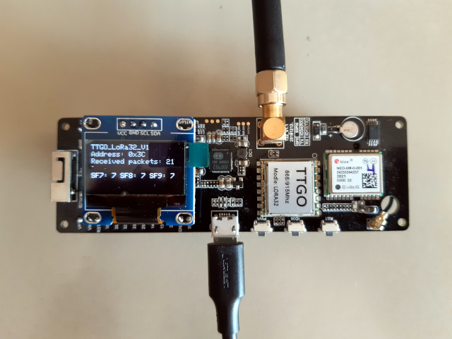

# Arduino-LoRa-Mesh

This repository contains a series of simple Arduino projects that were used or developed in the context of the doctoral thesis [Towards LoRa mesh networks for the IoT](http://hdl.handle.net/2117/360904).

## Simple LoRa sender/receiver

The `Simple_LoRa_sender` and `Simple_LoRa_receiver` folders contain two very simple counterpart programs. The former is used to send LoRa packets on a given frequency, bandwidth, SF, etc.; the latter receives them and prints some of the event details through the serial port. Both are largely based on the [RadioLib SX127x examples](https://github.com/jgromes/RadioLib/tree/master/examples/SX127x).

These projects were used to benchmark a LoRa point-to-point link, using two [LILYGO TTGO ESP32 LoRa32 v2.1 T3_1.6](http://www.lilygo.cn/prod_view.aspx?TypeId=50003&Id=1130&FId=t3:50003:3) devices, and compare it with the stripped-down LoRa code from [FLoRaMesh](https://github.com/DSG-UPC/FLoRaMesh) (a derivative work from [FLoRa](https://flora.aalto.fi/)):

As shown in the image above, the throughput curves are pretty similar (note the simulator allows for an arbitrarily big payload, while the hardware LoRa library is limited to 256 bytes). The image is available [here in EPS format](img/benchmark_flora_ttgo_throughput.eps).

## LoRaCAD sender/receiver

The `LoRaCAD_sender` folder contains a LoRa packet generator that transmits sequentially on different spreading factors (SFs) as configured by `MINSF` and `MAXSF`, honoring a 1% duty cycle. In turn, the code in the `LoRaCAD_receiver` folder allows a single-channel LoRa transceiver to receive incoming transmissions on any SF (one at a time, though). It takes advantage of its channel activity detection (CAD) feature to detect a LoRa packet preamble and dinamically reconfigure the radio to the appropriate SF. This was inspired by the [Single Channel LoRaWAN Gateway](https://github.com/things4u/ESP-1ch-Gateway) project and the paper _[An Adaptive Spreading Factor Selection Scheme for a Single Channel LoRa Modem](https://doi.org/10.3390/s20041008)_.

These projects were used to evaluate the feasibility of building a multi-SF LoRa mesh network using readily available hardware, like do-it-yourself (DIY) boards with a system-on-a-chip (SoC) and a LoRa transceiver. This idea was central to the above-mentioned thesis, and was validated by the packet reception rates detailed below. These were obtained with the depicted laboratory experimental setup.

Tx       | Rx 1   | Rx 2   | Rx 3   | Rx 4    | Rx 5    | Rx 6
-------- | ------ | ------ | ------ | ------- | ------- | ---------
SF7,8    | SF7,8  | SF7,8  | SF7,8  | SF6,7,8 | SF7,8,9 | SF6,7,8,9
870 pkt. | 99,1 % | 98,7 % | 99,5 % | 94,6 %  | 94,7 %  | 92,6 %

Tx        | Rx 1    | Rx 2    | Rx 3    | Rx 4      | Rx 5       | Rx 6
--------- | ------- | ------- | ------- | --------- | ---------- | ----------
SF7,8,9   | SF7,8,9 | SF7,8,9 | SF7,8,9 | SF6,7,8,9 | SF7,8,9,10 | SF7,8,9,10
1997 pkt. | 98,7 %  | 99,2 %  | 98,9 %  | 93,8 %    | 94,3 %     | 89,7 %

Tx         | Rx 1       | Rx 2       | Rx 3       | Rx 4         | Rx 5
---------- | ---------- | ---------- | ---------- | ------------ | -------------
SF7,8,9,10 | SF7,8,9,10 | SF7,8,9,10 | SF7,8,9,10 | SF6,7,8,9,10 | SF7,8,9,10,11
2524 pkt.  | $94,0 %    | $96,9 %    | $96,6 %    | $95,1 %      | $90,7 %

 acting as multi-SF receivers, and one LoRa32 (bottom, orange cable and no antenna) acting as sender.") 

## LoRaCHAN sender/receiver

The `LoRaCHAN_sender` folder contains a LoRa packet generator that transmits sequentially on different SFs, as configured by `MINSF` and `MAXSF`, **_and_** on different frequencies in the 868 MHz ISM band, as configured by `MINCHAN` and `MAXCHAN`. In turn, the code in the `LoRaCHAN_receiver` folder allows a single-channel LoRa transceiver to receive incoming transmissions on any SF **_and_** on different channels (one SF on one channel at a time). It takes advantage of the CAD feature to detect a LoRa packet preamble and dinamically reconfigure the radio to the appropriate SF, while continuously jumping to different channels. This was inspired by the paper _[TurboLoRa: Enhancing LoRaWAN Data Rate via Device Synchronization](https://doi.org/10.1109/CCNC49032.2021.9369523)_ (although their approach is radically different, since they use several LoRa transmitters in parallel to increase the global throughput).
